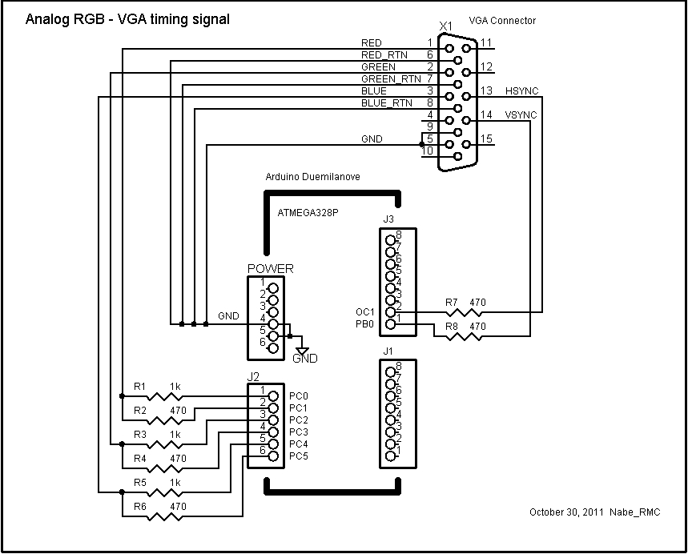

arduino-uno-vga
===============

- [Turn your Uno into a VGA output device! - #2 by nickgammon - Displays - Arduino Forum](https://forum.arduino.cc/t/turn-your-uno-into-a-vga-output-device/99969/2)
  - [Google Code Archive - Long-term storage for Google Code Project Hosting.](https://code.google.com/archive/p/arduino-vgaout/downloads)
    - [Arduino VGAout Example3 - YouTube](https://www.youtube.com/watch?v=W_3Ra9REQ9Y)
